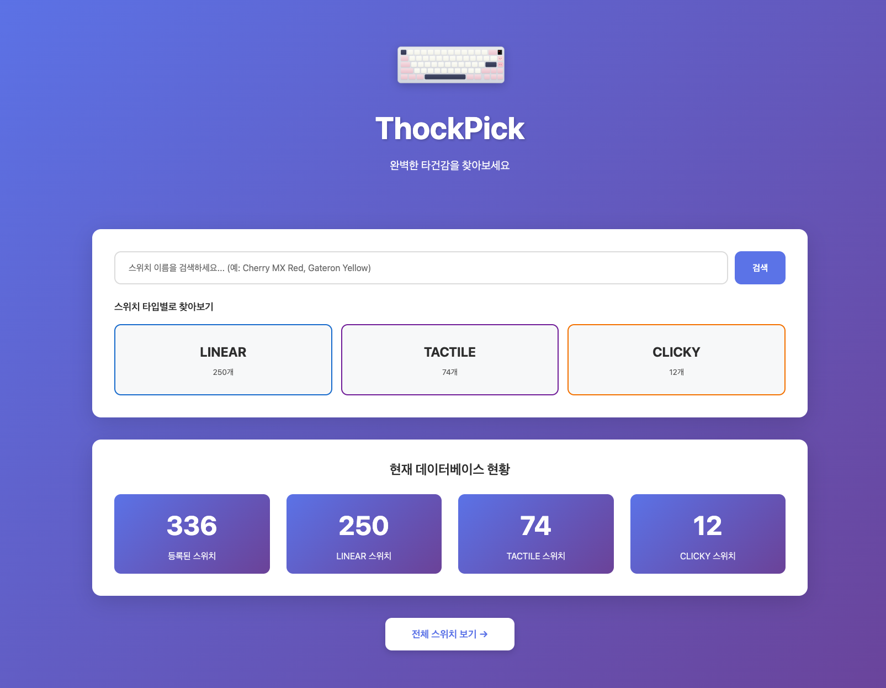

# ThockPick ⌨️

Google Sheets 기반의 키보드 부품 검색 및 타건음 추천 서비스



## 📋 프로젝트 소개

사용자의 취향(리니어/택타일 등)을 입력받아 적합한 키보드 스위치를 검색하고, 해당 부품의 타건음을 들을 수 있는 유튜브 영상을 추천하는 서비스입니다.

## 🛠️ 기술 스택

- **Backend**: Spring Boot 3.5.9, Java 17
- **ORM**: Spring Data JPA
- **Database**: MariaDB 
- **Template Engine**: Thymeleaf
- **CSS Framework**: Bootstrap 5
- **External API**: Google Sheets API
- **Cache** (예정): Redis
- **Search** (예정): Elasticsearch

## 🏗️ 아키텍처

```
Google Sheets → Scheduler → JPA → RDB
                              ↓
                    Elasticsearch (검색)
                    Redis (캐싱)
```

## 📚 문서

- [ARCHITECTURE.md](docs/ARCHITECTURE.md) - 시스템 아키텍처 상세
- [TECH_STACK.md](docs/TECH_STACK.md) - 기술 스택 설명
- [DATABASE_DESIGN.md](docs/DATABASE_DESIGN.md) - 데이터베이스 설계
- [API_DESIGN.md](docs/API_DESIGN.md) - REST API 명세
- [DEVELOPMENT_ROADMAP.md](docs/DEVELOPMENT_ROADMAP.md) - 개발 로드맵

## 🚀 빠른 시작

### 요구사항
- Java 17 이상
- Gradle 8.14.3

### 실행 방법
```bash
# 프로젝트 클론
git clone https://github.com/yourusername/thock-pick-server.git
cd thock-pick-server

# 빌드 & 실행
./gradlew bootRun
```

### 접속
- 애플리케이션: http://localhost:8080

## 🤝 기여

1인 개발 프로젝트이지만 피드백과 제안은 언제나 환영합니다!

## 📄 라이선스

MIT License
